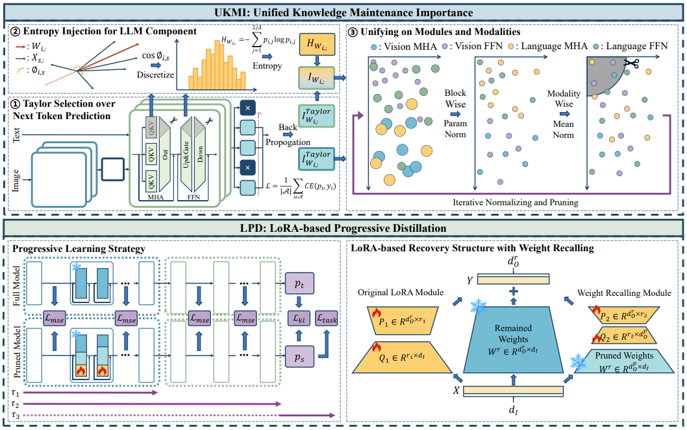

<div align="center">

# Unified Knowledge Maintenance Pruning and Progressive Recovery with Weight Recalling for Large Vision-Language Models

AAAI 2025

</div>

## Introduction

We propose a novel structured pruning approach, dubbed UKMP, for large vision-language models.


Framework of our proposed UKMP. During pruning, the UKMI module sequentially performs: $\textcircled{1}$ Select the poorly fitted token prediction sub-tasks to compose loss and backpropagate for revised Taylor importance. 
$\textcircled{2}$ Calculate the information entropy of angle distribution between token and weight vectors, and integrate it to the Taylor importance.
$\textcircled{3}$ Iteratively normalize the pre-computed importance and prune till target pruning ratio.
During recovery, the LPD module injects a LoRA-based structure with weight recalling to each weight matrix and then employs a progressive learning strategy for distillation.

## Requirements and Installation

The main code is in `LAVIS/`. Please do everything in `LAVIS/` by `cd LAVIS/`.

We recommend the requirements as follows.

- Python == 3.9
- Pytorch == 2.1.0
- CUDA Version >= 11.8

Install required editable `lavis` package by `pip install -e .`.

To get started quickly, you can use the following script.

```
git clone https://github.com/Wuzimeng/UKMP.git
cd UKMP
conda create -n ukmp python=3.9
conda activate ukmp
pip install torch==2.1.0 torchvision==0.16.0 torchaudio==2.1.0 --index-url https://download.pytorch.org/whl/cu118
cd LAVIS
pip install -e .
```

## Dataset

Follow the scripts in `lavis/datasets/download_scripts/` to download the datasets for evaluation.

We use the CC595K subset, filtered from CC3M (by the LLAVA project), for pruning. 
Please refer to <a href="https://huggingface.co/datasets/liuhaotian/LLaVA-CC3M-Pretrain-595K">LLaVA-CC3M-Pretrain-595K</a> to download the dataset and modify the dataset path in the `lavis/configs/datasets/prefix_conceptual_caption/cc3m_595k.yaml` file accordingly.
You may need to convert the annotation contents according to the script in `lavis/datasets/download_scripts/reconstruct_cc595k.py`.

## Prune and Finetune

The following script sequentially performs pruning → evaluation → finetuning → evaluation.

```bash
# at 50% pruning ratio
python scripts/structured_blip2/ukmp_0.5.py
```

## Acknowledgement

The project is built upon <a href="https://github.com/ylsung/ECoFLaP">ECoFLaP</a>, <a href="https://github.com/horseee/LLM-Pruner">LLM-Pruner</a>, <a href="https://github.com/salesforce/LAVIS">LAVIS</a>. We sincerely thank the original authors for their outstanding contributions!

## Citation

If you find our paper and code useful in your research, please consider giving a star ⭐ and citation 📝.

```bibtex
@inproceedings{wu2025ukmp,
  title={Unified knowledge maintenance pruning and progressive recovery with weight recalling for large vision-language models},
  author={Wu, Zimeng and Chen, Jiaxin and Wang, Yunhong},
  booktitle={Proceedings of the AAAI Conference on Artificial Intelligence},
  volume={39},
  number={8},
  pages={8550--8558},
  year={2025}
}
```